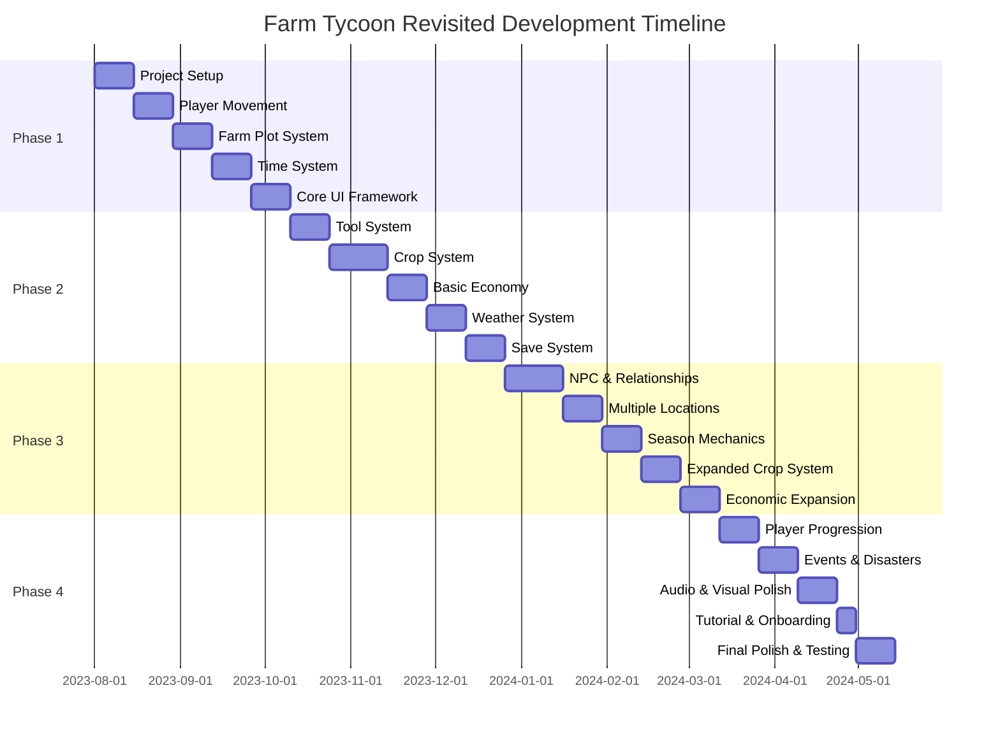

# Development Roadmap

This document outlines the planned development phases for Farm Tycoon Revisited, organized into manageable milestones that align with the 30-60 minute development sessions.

## Phase 1: Core Framework (Estimated: 4-6 weeks)

### Milestone 1: Project Setup
- Set up Godot project with proper structure
- Configure Git repository
- Establish basic asset pipeline
- Create initial project settings
- Set up basic CI/CD

### Milestone 2: Basic Player Movement
- Implement player character
- Basic movement controls
- Camera system
- Input handling for multiple platforms

### Milestone 3: Farm Plot System
- Implement grid-based farm system
- Create farm plot states (untilled, tilled, etc.)
- Build basic interaction system

### Milestone 4: Time System
- Implement day/night cycle
- Create time progression system
- Build calendar system for days, weeks, months
- Implement basic season transitions

### Milestone 5: Core UI Framework
- Design and implement HUD
- Create main menu
- Implement basic inventory display
- Build status indicators (time, energy, etc.)

## Phase 2: Core Gameplay Systems (Estimated: 8-10 weeks)

### Milestone 6: Tool System
- Implement all basic tools
- Create tool selection interface
- Build tool effects on farm plots
- Implement stamina consumption

### Milestone 7: Crop System
- Create crop database
- Implement growth stages
- Build watering and fertilizing systems
- Create harvesting mechanics

### Milestone 8: Basic Economy
- Implement inventory system
- Create shop interface
- Build buying and selling mechanics
- Implement basic pricing system

### Milestone 9: Weather System
- Create weather states
- Implement weather effects on crops
- Build weather transition system
- Create visual effects for weather

### Milestone 10: Save System
- Design save data structure
- Implement saving and loading
- Create multiple save slots
- Build export/import functionality

## Phase 3: Content & Depth (Estimated: 8-10 weeks)

### Milestone 11: NPC & Relationship System
- Implement shopkeeper character
- Create basic dialogue system
- Build relationship tracking
- Implement gift system

### Milestone 12: Multiple Locations
- Create world map
- Implement location transitions
- Build all core locations (farm, shop, home, etc.)
- Create location-specific interactions

### Milestone 13: Season Mechanics
- Implement all five seasons
- Create seasonal effects on gameplay
- Build seasonal events
- Implement season-specific visuals

### Milestone 14: Expanded Crop System
- Add diverse crop types
- Implement seasonal crop advantages
- Create crop quality system
- Build special crop types

### Milestone 15: Economic Expansion
- Implement price fluctuations
- Create special orders system
- Build newspaper for market information
- Implement storage quality degradation

## Phase 4: Polish & Extensions (Estimated: 6-8 weeks)

### Milestone 16: Player Progression
- Implement skill development
- Create upgrades system
- Build achievement tracking
- Implement unlockable content

### Milestone 17: Events & Disasters
- Create random event system
- Implement natural disasters
- Build festival events
- Create special quests

### Milestone 18: Audio & Visual Polish
- Add music and sound effects
- Implement particle effects
- Create animation polish
- Build visual feedback systems

### Milestone 19: Tutorial & Onboarding
- Create tutorial system
- Implement help guides
- Build contextual tips
- Create progressive difficulty

### Milestone 20: Final Polish & Testing
- Performance optimization
- Cross-platform testing
- Bug fixing
- Balance adjustments

## Development Timeline

## Implementation Priority Guidelines

When implementing features, follow these priority guidelines:

1. **Core Mechanics First**: Focus on fundamental gameplay systems before adding complexity
2. **Vertical Slice Approach**: Build one complete feature flow before expanding breadth
3. **Test Early, Test Often**: Implement testing throughout development
4. **Polish Incrementally**: Add basic polish as you go rather than leaving it all for the end
5. **Performance Matters**: Consider optimization from the beginning

## Adapting the Roadmap

This roadmap should be treated as a living document. After each milestone:

1. Review progress and adjust timeline if needed
2. Evaluate feature priorities based on implementation experience
3. Consider adding or removing features based on gameplay testing
4. Adjust resource allocation for remaining tasks 