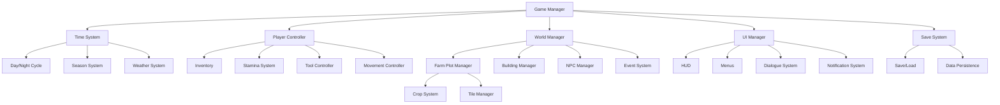

# Technical Architecture

This document outlines the technical architecture for Farm Tycoon Revisited, focusing on the Godot Engine implementation.

## System Architecture Overview



## Core Systems

### Game Manager
The central controller that initializes and manages all other systems. Handles game states, scene transitions, and global events.

**Key Components:**
- Main game loop
- System initialization
- Scene management
- Global event bus

### Time System
Manages the passage of time in the game world, including day/night cycles, seasons, and weather.

**Key Components:**
- TimeManager: Controls time progression
- SeasonManager: Handles seasonal changes
- WeatherSystem: Generates and applies weather events

### Player System
Handles player input, movement, inventory, and actions.

**Key Components:**
- PlayerController: Processes input and controls player character
- InventorySystem: Manages player items and resources
- StaminaSystem: Tracks and updates player energy levels
- ToolSystem: Implements tool functionality and effects

### World System
Manages the game world, including farm plots, buildings, NPCs, and events.

**Key Components:**
- FarmManager: Handles farm plot states and interactions
- CropSystem: Manages crop growth and harvesting
- NPCManager: Controls NPC behavior and relationships
- EventSystem: Triggers and manages game events

### UI System
Manages all user interface elements, menus, and visual feedback.

**Key Components:**
- UIManager: Handles UI initialization and updates
- DialogueSystem: Manages character conversations
- HUDController: Updates and displays game information
- MenuSystem: Manages game menus and navigation

### Save System
Handles game data persistence, saving, and loading.

**Key Components:**
- SaveManager: Controls save/load operations
- DataSerializer: Converts game objects to storable data
- FileIO: Handles file reading and writing

## Data Structure

### Game Data
```
GameData
├── PlayerData
│   ├── Inventory
│   ├── Stats
│   ├── Relationships
│   └── Progress
├── WorldData
│   ├── TimeData
│   ├── SeasonData
│   ├── WeatherData
│   └── EventData
├── FarmData
│   ├── Plots
│   ├── Crops
│   └── Buildings
└── ShopData
    ├── Inventory
    ├── Prices
    └── SpecialOrders
```

### Save File Format
The game will use JSON for save data, with the following structure:

```json
{
  "version": "1.0",
  "player": {
    "inventory": [],
    "stats": {},
    "relationships": {}
  },
  "world": {
    "time": {},
    "season": {},
    "weather": {}
  },
  "farm": {
    "plots": [],
    "buildings": []
  },
  "shop": {
    "inventory": [],
    "prices": {}
  }
}
```

## Implementation Approach

### Scene Structure
The game will be organized into the following key scenes:

1. **MainMenu**: Entry point with game options
2. **GameWorld**: Core gameplay scene containing:
   - Farm scenes
   - Building interiors
   - Transition areas
3. **UI Overlay**: HUD and controls
4. **Dialogue System**: Character interactions

### Resource Management
- Use resource preloading for commonly accessed assets
- Implement dynamic loading for location-specific assets
- Create a central resource cache for optimal memory usage

### Input Handling
- Implement multi-platform input support
- Touch controls for mobile
- Keyboard/mouse for desktop
- Controller support for optimal gameplay experience

### Save System Implementation
- Autosave at key moments (end of day, location changes)
- Multiple save slots
- JSON file export/import for cross-device play
- Save versioning for future compatibility

## Technical Considerations

### Performance Optimization
- Limit active entities based on player location
- Use object pooling for frequently created/destroyed objects
- Optimize rendering with occlusion culling
- Implement LOD (Level of Detail) for complex objects

### Cross-Platform Compatibility
- Design UI for both touch and mouse input
- Scale assets appropriately for different screen sizes
- Adjust gameplay mechanics for different input methods
- Test on all target platforms regularly

### Code Organization
- Follow Godot's node-based architecture
- Use composition over inheritance
- Implement signals for loose coupling between systems
- Maintain clear separation of concerns 